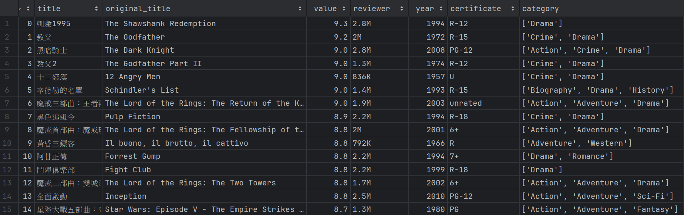

# Web Crawler
## What is Web Crawler
> A web crawler is a computer program that systematically navigates the web, extracting data from websites for indexing and analysis.

## Why we need Web Crawler
### 1. **Search Engines**:
> Web crawlers index web content, allowing search engines to provide relevant search results.

### 2. **Data Collection**
> They gather data for analysis, research, and business intelligence.

### 3. **Content Aggregation** 
> Web crawlers aggregate content from multiple sources, making it accessible in one place.

### 4. **Monitoring**
> They monitor websites for changes, ensuring content is up-to-date.

### 5. **Market Research** 
> Web crawlers track market trends, pricing, and competitors for businesses.

### 6. **News Updates**
> They deliver real-time news by scraping news sites.

### 7. **Accessibility** 
> Web crawlers retrieve web content for users who may have accessibility needs.

## How to install
```shell
# Ensure have installed the git 
git clone https://github.com/weiawesome/web_crawler_tutorial.git
```

## How to start
```shell
# Ensure have installed pip and python
pip install -r requirements.txt
python main.py
```
## Result file
It will be stored in the "./result.csv".



